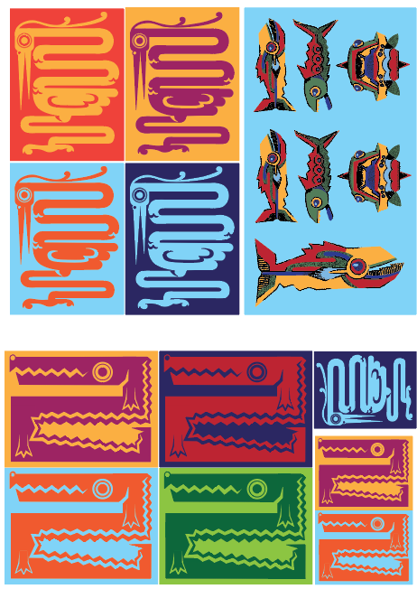

MDDN242 Project 1:
Lily Hagen, My Portfolio

### My goal

I wanted the website to still show some of my personal style somehow since its a portfolio website, but still be pretty clear to navigate. I also want to get more comfortable with AI and how it works as I've been opposed to using it but I'd like to understand it and grow with it.

### Inspirations
Mini Moodboard: https://app.milanote.com/1VV0L01wigMc5W/mddn242 

 - my favourite things to make digitally, that shows both how i design and draw

### Why this direction

After some initial style tests, inserting different images of my own work and using a fish png I'd drawn, it reminded me of the geometric animals I draw alot and thought the crocodile would also go well with the fish and help to add other interactve elements while being cohesive.
I want it to still feel like a website. Websites with too much interativity are fun but can be fustrating to me. I enjoy bold flat colours and use them in alot of my work so wanted it to be done well and personalized to be to reflect that. This also mean't that adding content ontop of this would not be too much of an eyesore.

In doing this I made the colours bold, and felt the name of the website (which I made my name) needed to be bold.

### Who is this for

Me, friends, family or random people that have somehow stumbled onto my work. I don't want it to be taken too seriously and feel a little fun but still relaxing and easy.

### Colour

I landed on complementry colours of orange and purple as they are my favourite, but also stand out from eachother while still being warm colours. I wanted warm colours as I feel this would take away the 'corperate-ness'. They allow for contrast and additions of different shades without making it seem like the colour palette is over the top.

### Typography

I chose a bold san serif font called 'Paytone One' for my name as it balanced out the graphics while also making the title choice itself (my name) a bold choice. 

I also used a thin san serif called 'Lexenda Exa' as its simple, round and modern while fitting with the bold title font balancing it out.

### Layout & structure

The user enters to a 'landing' page where they are free to interact and explore the screen. I made the croc centered between the top text and bottom giving the space balance.

I used a centered composition through the website as it balances out the crocodile that pops out the side and also makes it feel more like moving through 'scenes' even though it's still a very basic website.

### Interaction & motion

The floating bubbles that across the screen and give the space some depth pop when hovered over by the fish cursor. I wanted more fun interactions within the website.
Obviously the crocodile tail and head move when hovered over, I wanted it to look a little like the fish was being eaten.
When the fish cursor interacts with something its eye closes, looking happy.

How did you use AI tools in this project? This section is important. We want to see how you worked with AI, not just that you did.

### Tools used
- Copilot (originally)
- Claude (later on)

### How you used them

I would copy and paste back and forth. And by having conversation over multiple sessions. Usually with very brief prompting that I slowly got better at wording in relation to what it understood so I could get an outcome more alligned with my own vision, not the AI's.

### What you used AI for

Code, copy & debugging

### What worked

Asking 'how do I fix this' would often help it explain things simply without going on a long step by step monologue

```
Example prompt that worked well:
"Can you add other page connected to the 'work section' title 'Personal Work' using this layout"(insert screenshot of layout made in Illustrator)

"in the personal work page can you lay it out like this, (image included) ensuring the 'drawing1.png' image fits the screen and sits in the center, the blue is where the title 'Personal Work' goes then the yellow is where my description goes. here is the work2.html:..." 
```

### What didn't work

Asking too many things at once would be hard for me to keep up with and would also result in other things malfunctioning, e.g the crocodile would stop sliding out if too many prompts were said and including anything to do with the buttons. 

###Tools & libraries

| Tool | Purpose |
|------|---------|
|  Adobe Illustrator | drawings/backgrounds |
|  Google Fonts | typography |
| Photoshop | resizing canvas for custom cursor |

### Browser & mobile testing

- Tested on:  Chrome, Firefox
- Mobile tested on: e.g. Android — formated okay but the crocodile was not very accessible, decided to make a 'made for desktop use' screen instead.

### What I learned

Be specific. "I learned CSS Grid" is less useful than "I learned how to use CSS Grid to build a layout that adapts without media queries."
I learned how to better/more properly structure my code, understanding the order, why it matters and the key differences

### What I'd do differently

If you started again tomorrow, what would change?
If I could start again tomorrow, I'd experiment more with some textures, more interactable features like the bubbles and crocodile. I'd probably still head in this direction just step slightly further away from 'basic website' while still maintaining easy accessibility and functionality. I'd focus more on accessibility aspects and how I can better cater to that.

### What I'm most proud of

The transition between sections, it feels natural, deliberate and fun. as well as the crocodile scroll mechanic

### Where this sits in my practice

It connects how I design (flat bold colours) with how I draw/illustrate (geometric drawings and patterning), which usually appear very differently and are hard to draw connections between. It's a good representation of me, how I currently design and where I want to go with it (some kind of illustration possibly).
